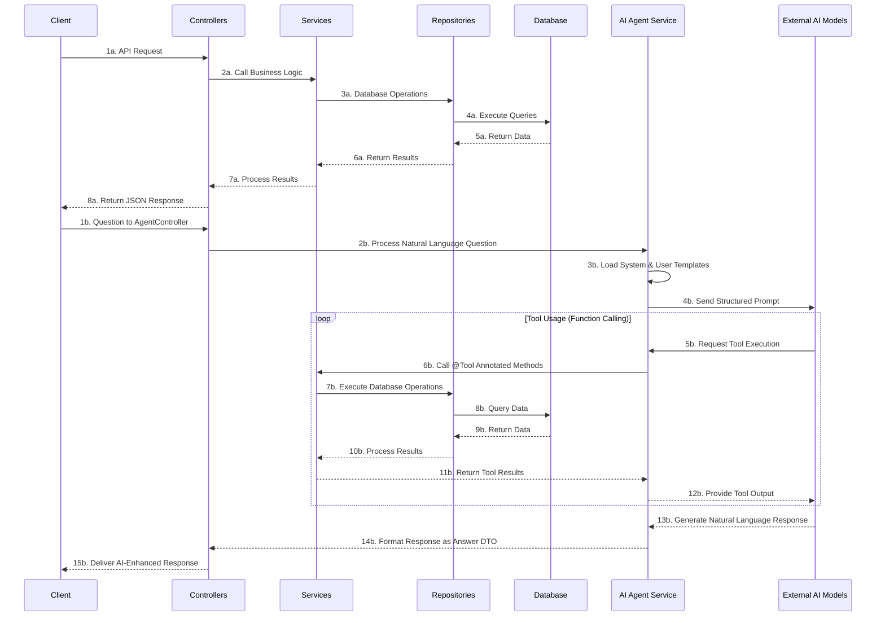

# Spring AI MCP: Inventory Management System with AI Integration

[](https://www.oracle.com/java/technologies/javase-jdk17-downloads.html)
[](https://spring.io/projects/spring-boot)
[](https://spring.io/projects/spring-ai)
[](LICENSE)

## 📚 Project Overview

This Spring Boot application demonstrates a sophisticated inventory and user management system enhanced with AI capabilities. It showcases how to integrate multiple AI models (Google Gemini and Anthropic Claude) through Spring AI to provide natural language query capabilities for inventory and user data, leveraging Spring AI's powerful Tools/Function Calling feature.

## ✨ Features

- 🤖 AI-powered natural language query interface using Spring AI
- 📦 Complete inventory management system
- 👥 User management with role-based access
- 📊 RESTful API with comprehensive OpenAPI documentation
- 🧠 Integration with multiple AI models (Gemini and Claude)
- 🔄 Tool-based AI interaction pattern
- 🗄️ H2 in-memory database for development

## 🧠 Spring AI: Tools / Function Calling Explained

### Core Concept: What is Function Calling/Tool Use?

Function Calling (or Tool Use) is a powerful mechanism that enables Large Language Models (LLMs) to request the execution of specific, developer-defined functions (tools) within your Spring application. Instead of solely generating text, the LLM can:

* Access real-time data (e.g., inventory records, user profiles)
* Interact with private or external APIs
* Perform actions (e.g., querying databases, executing business logic)
* Utilize information the model wasn't originally trained on

Essentially, it bridges the gap between the LLM's generative capabilities and your application's specific functionalities or data sources.

### Spring AI Implementation

Spring AI provides abstractions and integrations to make implementing function calling straightforward within a Spring application:

1. **Defining Tools:**
  * Tools are defined as standard Java methods annotated with `@Tool` within Spring service classes
  * Method parameters can be annotated with `@ToolParam` to provide descriptions
  * These descriptions help the LLM understand what the function does and when to call it

2. **Making Tools Available:**
  * When making an API call to the LLM using the `ChatClient`, you specify which tools should be made available
  * Spring AI handles the necessary protocol details to inform the underlying LLM about the available functions

3. **Handling Function Call Requests from the LLM:**
  * If the LLM determines that invoking one of the provided functions is necessary, it will make the call
  * The LLM extracts arguments from the conversation context to pass to the function

4. **Executing the Function:**
  * Spring AI handles the execution of the requested function with the provided arguments
  * The function is executed within your application's context with full access to your services and repositories

5. **Returning the Result to the LLM:**
  * After executing the function, Spring AI returns the result to the LLM
  * The LLM uses this result to formulate its final textual response to the original user prompt

### Benefits in Spring AI Context

* **Abstraction:** Simplifies interaction with different AI models that support function calling
* **Integration:** Leverages familiar Spring concepts like Beans and Dependency Injection
* **Power:** Dramatically extends the capabilities of the LLM by grounding it in your application's context and data
* **Consistency:** Ensures reliable, accurate responses based on your actual business data

## 🏗️ Architecture Components

### Core API Layers
1. **RESTful Controllers**
  - Well-structured controllers with comprehensive OpenAPI documentation
  - Consistent error handling and response patterns
  - Support for pagination and flexible querying

2. **Service Layer**
  - Clear separation of concerns with interface-based design
  - Transaction boundaries for data integrity
  - Rich validation and exception handling
  - Service methods annotated with `@Tool` for AI integration

3. **Data Entities**
  - JPA entities with proper relationships
  - Validation constraints using Jakarta Bean Validation
  - Audit fields for tracking creation and updates

### AI Integration
1. **Multi-Model Support**
  - Anthropic Claude integration (`claude-3-5-sonnet-20241022`)
  - Google Gemini integration (`gemini-2.0-flash`)
  - Configurable model parameters (temperature, token limits)

2. **Natural Language Interface**
  - Question/Answer paradigm for inventory queries
  - AI-powered agent service for processing natural language
  - Prompt templating system for consistent AI interactions

3. **Tool-Based AI Access**
  - Spring AI annotations for method discovery (`@Tool`, `@ToolParam`)
  - Domain service methods as AI tools
  - Dynamic database querying capabilities

## 🛠️ Technical Implementation

### Technology Stack
- **Spring Boot**: Core framework for the application
- **Spring AI**: Integration with AI services and tool/function calling
- **Spring Data JPA**: Database interactions
- **H2 Database**: In-memory database for development
- **SpringDoc OpenAPI**: API documentation

### Database Configuration
```properties
# Datasource Configuration
spring.datasource.url=jdbc:h2:mem:testdb
spring.datasource.driver-class-name=org.h2.Driver
spring.datasource.username=sa
spring.datasource.password=

# JPA Configuration
spring.jpa.hibernate.ddl-auto=update
spring.jpa.show-sql=true
spring.jpa.properties.hibernate.format_sql=true
spring.jpa.database-platform=org.hibernate.dialect.H2Dialect

# H2 Console Configuration
spring.h2.console.enabled=true
spring.h2.console.path=/h2-console
```

### AI Service Configuration
```properties
# Google Gemini Configuration
spring.ai.openai.chat.base-url=https://generativelanguage.googleapis.com
spring.ai.openai.chat.completions-path=/v1beta/openai/chat/completions
spring.ai.openai.api-key=${GEMINI_AI_API_KEY}
spring.ai.openai.chat.options.model=gemini-2.0-flash

# Anthropic Configuration
spring.ai.anthropic.api-key=${ANTHROPIC_API_KEY}
spring.ai.anthropic.chat.options.model=claude-3-5-sonnet-20241022
spring.ai.anthropic.chat.options.temperature=1
spring.ai.anthropic.chat.options.max-tokens=8192
```

## 📊 System Flow Diagram



## 📝 API Endpoints

### Product Management
- `GET /api/products` - Get all products (paginated)
- `GET /api/products/{id}` - Get product by ID
- `GET /api/products/sku/{sku}` - Get product by SKU
- `GET /api/products/category/{categoryId}` - Get products by category
- `GET /api/products/price-range` - Get products by price range
- `GET /api/products/search` - Search products by name
- `POST /api/products` - Create a new product
- `PUT /api/products/{id}` - Update an existing product
- `DELETE /api/products/{id}` - Delete a product

### Category Management
- `GET /api/categories` - Get all categories (paginated)
- `GET /api/categories/{id}` - Get category by ID
- `GET /api/categories/name/{name}` - Get category by name
- `GET /api/categories/search` - Search categories by name
- `POST /api/categories` - Create a new category
- `PUT /api/categories/{id}` - Update an existing category
- `DELETE /api/categories/{id}` - Delete a category

### User Management
- `GET /api/users` - Get all users (paginated)
- `GET /api/users/{id}` - Get user by ID
- `GET /api/users/username/{username}` - Get user by username
- `GET /api/users/email/{email}` - Get user by email
- `GET /api/users/role/{role}` - Get users by role
- `POST /api/users/register` - Register a new user
- `PUT /api/users/{id}` - Update an existing user
- `DELETE /api/users/{id}` - Delete a user
- `PUT /api/users/{id}/roles` - Add role to user
- `DELETE /api/users/{id}/roles` - Remove role from user

### Authentication
- `POST /api/auth/register` - Register a new user

### AI Integration
- `POST /api/agent/question` - Ask natural language questions about inventory and users

## 🧩 Key Components

### AgentService Implementation
The `AgentServiceImpl` class is the core of the AI integration:

```java
@Service
@RequiredArgsConstructor
@Slf4j
public class AgentServiceImpl implements AgentService {
    private final CategoryService categoryService;
    private final ProductService productService;
    private final UserService userService;
    private final AgentUtil agentUtil;

    @Autowired
    @Qualifier("anthropicChatClient")
    private ChatClient anthropicChatClient;

    @Autowired
    @Qualifier("geminiAiChatClient")
    private ChatClient geminiChatClient;

    // Template resources
    @Value("classpath:templates/ai/system/store/inventory-and-users.structure.st")
    private Resource systemSummaryBookTemplate;

    @Value("classpath:templates/ai/user/store/inventory-and-users.structure.st")
    private Resource userSummaryBookTemplate;

    @SneakyThrows
    @Override
    public Answer getAnswer(Question question) {
        if (question == null || question.getText() == null) {
            log.error("Question or its text cannot be null. {}", question);
            throw new IllegalArgumentException("Question or its text cannot be null.");
        }
        
        ObjectMapper objectMapper = new ObjectMapper();
        String questionJson = objectMapper.writeValueAsString(question);

        PromptTemplate systemPromptTemplate = new PromptTemplate(this.systemSummaryBookTemplate);
        PromptTemplate userPromptTemplate = new PromptTemplate(this.userSummaryBookTemplate);
        BeanOutputConverter<Answer> format = new BeanOutputConverter<>(Answer.class);

        Prompt systemPrompt = systemPromptTemplate.create();
        Prompt userPrompt = userPromptTemplate.create(Map.of("question", questionJson, "format", format.getFormat()));

        String aiResponse =
                anthropicChatClient.prompt(systemPrompt)
                        .advisors(new SimpleLoggerAdvisor())
                        .user(userPrompt.getContents())
                        .tools(this.agentUtil)
                        .call().content();

        if (aiResponse == null) {
            log.error("AI response is null for question: {}", questionJson);
            throw new IllegalStateException("AI response cannot be null.");
        }
        
        return format.convert(aiResponse);
    }
}
```

### Tool-Based AI Access
The service methods are exposed to AI using the `@Tool` annotation:

```java
@Tool(description = "Find products by category ID with pagination")
public Page<Product> findProductsByCategory(
        @ToolParam(description = "Category ID to filter by") Long categoryId, 
        @ToolParam(description = "Pagination settings") Pageable pageable) {
    // Verify category exists
    if (!categoryService.existsById(categoryId)) {
        throw new NoSuchElementException("Category not found with id: " + categoryId);
    }
    return productRepository.findByCategoryId(categoryId, pageable);
}

@Tool(description = "Check if a user exists by ID")
public boolean existsById(@ToolParam(description = "ID of the user to check") Long id) {
    return userRepository.existsById(id);
}

@Tool(description = "Execute a SQL query and return all tables in the database")
public List<Map<String, Object>> getAllTables() {
    String sql = "SELECT TABLE_NAME FROM INFORMATION_SCHEMA.TABLES WHERE TABLE_SCHEMA = 'PUBLIC'";
    return jdbcTemplate.queryForList(sql);
}
```

### Entity Relationships
The core entities are structured with appropriate relationships:

```java
@Entity
@Table(name = "products")
@Data
@NoArgsConstructor
@AllArgsConstructor
public class Product {
    @Id
    @GeneratedValue(strategy = GenerationType.IDENTITY)
    private Long id;
    
    @NotBlank(message = "Product name is required")
    @Column(nullable = false)
    private String name;
    
    private String description;
    
    @NotNull(message = "Price is required")
    @Positive(message = "Price must be positive")
    @Column(nullable = false)
    private BigDecimal price;
    
    @NotBlank(message = "SKU is required")
    @Column(unique = true, nullable = false)
    private String sku;
    
    @ManyToOne(fetch = FetchType.LAZY)
    @JoinColumn(name = "category_id")
    private Category category;
    
    // Audit fields
    @CreationTimestamp
    @Column(name = "created_at", nullable = false, updatable = false)
    private LocalDateTime createdAt;
    
    @UpdateTimestamp
    @Column(name = "updated_at")
    private LocalDateTime updatedAt;
}
```

## 🚀 Getting Started

### Prerequisites
- Java 17 or higher
- Maven or Gradle
- API keys for Anthropic Claude and Google Gemini

### Environment Variables
Create a `.env` file with the following variables:
```
ANTHROPIC_API_KEY=your_anthropic_api_key
GEMINI_AI_API_KEY=your_gemini_api_key
```

### Running the Application
1. Clone the repository
   ```bash
   git clone https://github.com/maxiplux/spring-ai-mcp-tools-and-patterns.git
   cd spring-ai-mcp-tools-and-patterns
   ```

2. Build the project
   ```bash
   ./gradlew build
   ```

3. Run the application
   ```bash
   ./gradlew bootRun
   ```

4. Access the application
  - API Documentation: http://localhost:8080/swagger-ui.html
  - H2 Console: http://localhost:8080/h2-console

## 📄 License

This project is licensed under the MIT License - see the [LICENSE](LICENSE) file for details.